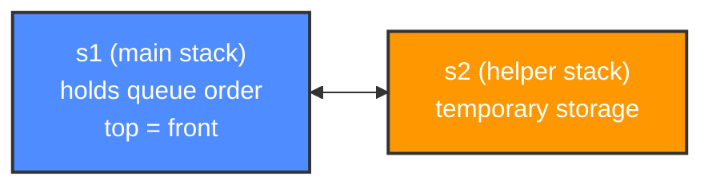
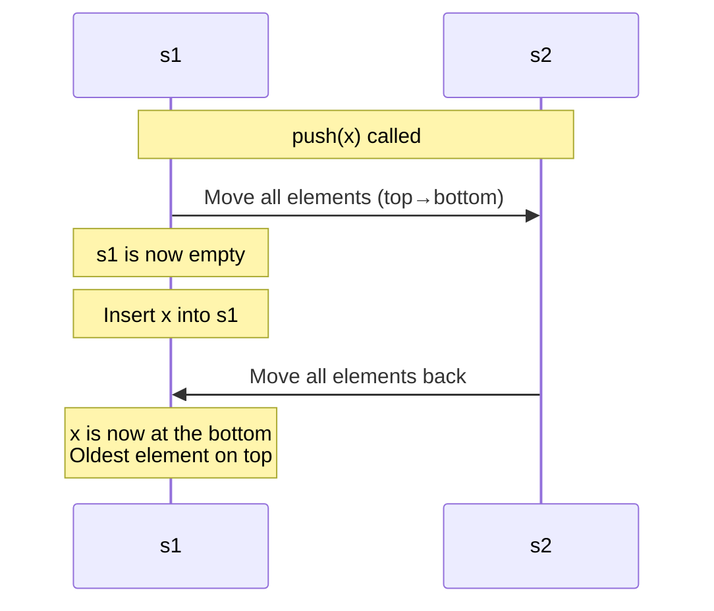
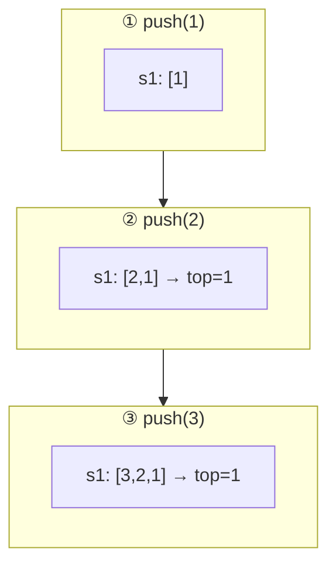
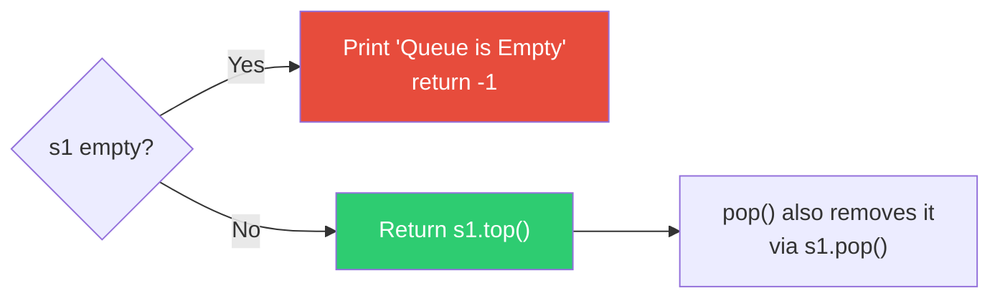
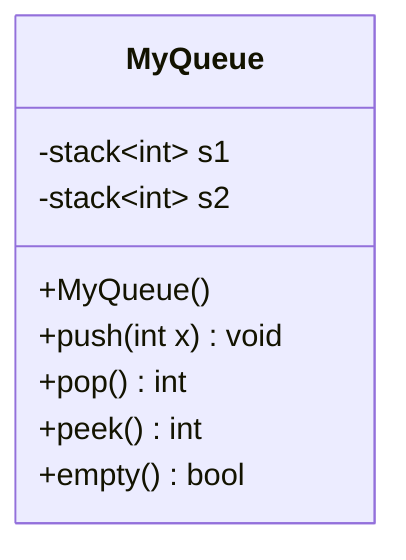

# 🔄 Implement Queue using Stacks

A C++ implementation of a **Queue (FIFO)** built entirely from two **Stacks (LIFO)** — a classic data structures interview problem.

---

## 📌 Overview

A queue processes elements **First-In-First-Out (FIFO)**, while a stack processes elements **Last-In-First-Out (LIFO)**. This implementation simulates FIFO behavior using two LIFO stacks, `s1` and `s2`.

**Strategy used:** Make `push` costly, `pop` cheap.

| Operation | Cost | What it does |
|---|---|---|
| `push(x)` | O(n) | Reorders elements so the newest item ends up at the **bottom** |
| `pop()` | O(1) | Simply pops from `s1` — the front of the queue is always on top |
| `peek()` | O(1) | Returns `s1.top()` |
| `empty()` | O(1) | Returns `s1.empty()` |

---

## 🧠 Core Idea



Every time we **push**, we temporarily drain `s1` into `s2`, drop the new element into the now-empty `s1`, then pour everything back — placing the new element at the **bottom** of `s1`. This keeps the **oldest** element always on top, ready to `pop()`.

---

## ⚙️ `push(x)` — Step by Step



### Visual walkthrough — `push(1)`, `push(2)`, `push(3)`



📎 Notice: after every `push`, the **oldest** element (`1`) always stays on **top** of `s1` — exactly what `pop()` needs.

---

## 📤 `pop()` / `peek()`



---

## 🧩 Class Structure



---

## 💻 Code

```cpp
class MyQueue {
public:
    stack<int> s1;
    stack<int> s2;

    MyQueue() {}

    // Push element into queue
    void push(int x) {
        // Move all elements from s1 to s2
        while (!s1.empty()) {
            s2.push(s1.top());
            s1.pop();
        }

        // Push new element
        s1.push(x);

        // Move elements back to s1
        while (!s2.empty()) {
            s1.push(s2.top());
            s2.pop();
        }
    }

    // Remove front element
    int pop() {
        if (s1.empty()) {
            cout << "Queue is Empty" << endl;
            return -1;
        }
        int ans = s1.top();
        s1.pop();
        return ans;
    }

    // Get front element
    int peek() {
        if (s1.empty()) {
            cout << "Queue is Empty" << endl;
            return -1;
        }
        return s1.top();
    }

    // Check empty
    bool empty() {
        return s1.empty();
    }
};
```

---

## ⏱️ Complexity Analysis

| Operation | Time Complexity | Space Complexity |
|---|:---:|:---:|
| `push(x)` | **O(n)** | O(1) extra |
| `pop()` | **O(1)** | O(1) |
| `peek()` | **O(1)** | O(1) |
| `empty()` | **O(1)** | O(1) |

> 💡 **Alternative approach:** You can flip the cost — make `push` **O(1)** and `pop` **O(amortized 1)** by only transferring elements from `s1` to `s2` when `s2` is empty during a `pop`. This version prioritizes simplicity and guarantees push is always cheap.

---

## 🚀 Example Usage

```cpp
int main() {
    MyQueue q;
    q.push(10);
    q.push(20);
    q.push(30);

    cout << q.peek() << endl; // 10
    cout << q.pop()  << endl; // 10
    cout << q.pop()  << endl; // 20
    cout << q.empty() << endl; // 0 (false)
    cout << q.pop()  << endl; // 30
    cout << q.empty() << endl; // 1 (true)
}
```

**Output:**
```
10
10
20
0
30
1
```

---

## ✅ Summary

- Uses **two stacks** to emulate **FIFO** behavior with **LIFO** primitives.
- `push` does the heavy lifting (O(n)); `pop`/`peek` are instant (O(1)).
- A great illustration of how data structures can be composed to build new ones.

---

⭐ *If this helped you understand the pattern, consider starring the repo!*