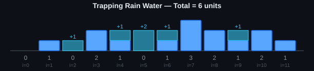

# 🌧️ Trapping Rain Water — Two Pointer Solution (C++)

> Given an elevation map, compute how much rainwater it can trap after raining — solved in **O(n) time** and **O(1) extra space** using the two-pointer technique.


-brightgreen)
-brightgreen)

---

## 📌 Problem Statement

You're given `n` non-negative integers representing an elevation map where the width of each bar is `1`. Compute how much water it can trap after raining.

**Example**

```
Input:  height = [0,1,0,2,1,0,1,3,2,1,2,1]
Output: 6
```

## 🖼️ Visual Example

The blue bars are the "walls" (bar heights). The light-blue overlay is the **water trapped** at each position.



For the sample input above, water collects in the low points between taller bars, giving a total of **6 units** of trapped water.

---

## 💡 Intuition

For any bar at index `i`, the water it can hold is limited by the **shorter** of the tallest bar to its left and the tallest bar to its right:

```
water[i] = min(maxLeft[i], maxRight[i]) - height[i]
```

A brute-force solution computes `maxLeft` and `maxRight` for every index (O(n) extra space). The **two-pointer trick** avoids the extra arrays entirely by moving inward from both ends of the array, always processing the side with the *smaller* current height — because that side's water level is already guaranteed to be capped by the max on the other side.

---

## ⚙️ How the Algorithm Works

```mermaid
flowchart TD
    A[Start: l = 0, r = n-1, leftMax = 0, rightMax = 0, total = 0] --> B{l < r ?}
    B -- No --> Z[Return total]
    B -- Yes --> C{height[l] <= height[r] ?}

    C -- Yes --> D{leftMax > height[l] ?}
    D -- Yes --> E[total += leftMax - height[l]]
    D -- No --> F[leftMax = height[l]]
    E --> G[l++]
    F --> G[l++]
    G --> B

    C -- No --> H{rightMax > height[r] ?}
    H -- Yes --> I[total += rightMax - height[r]]
    H -- No --> J[rightMax = height[r]]
    I --> K[r--]
    J --> K[r--]
    K --> B
```

**Step by step:**

1. Place two pointers, `l` at the start and `r` at the end of the array.
2. Track `leftMax` (tallest bar seen so far from the left) and `rightMax` (tallest bar seen so far from the right).
3. Compare `height[l]` and `height[r]`:
   - If `height[l] <= height[r]`, the water level at `l` is bounded by `leftMax`, so process the **left** side and move `l` inward.
   - Otherwise, process the **right** side and move `r` inward.
4. At each step, either update the running max, or add the trapped water (`max - current height`) to the total.
5. Stop when the pointers meet — `total` now holds the answer.

---

## 🧑‍💻 Code

```cpp
#include <stack>
#include <vector>
#include <iostream>
using namespace std;

class Solution {
public:
    int trap(vector<int>& height) {
        int l = 0;
        int r = height.size() - 1;

        int total = 0;

        int leftmax = 0;
        int rightmax = 0;

        while (l < r) {

            if (height[l] <= height[r]) {

                if (leftmax > height[l]) {
                    total += leftmax - height[l];
                }
                else {
                    leftmax = height[l];
                }

                l++;
            }
            else {

                if (rightmax > height[r]) {
                    total += rightmax - height[r];
                }
                else {
                    rightmax = height[r];
                }

                r--;
            }
        }

        return total;
    }
};

int main() {

    Solution s;

    vector<int> height = {
        0, 1, 0, 2, 1, 0,
        1, 3, 2, 1, 2, 1
    };

    int total = s.trap(height);

    cout << "Total trapped water = " << total << endl;

    return 0;
}
```

---

## ▶️ How to Run

```bash
g++ -std=c++17 -O2 -o trap trap.cpp
./trap
```

**Expected Output**

```
Total trapped water = 6
```

---

## 📊 Complexity Analysis

| Metric | Complexity | Why |
|---|---|---|
| Time  | `O(n)` | Each pointer moves inward at most `n` times total |
| Space | `O(1)` | Only a handful of scalar variables are used, no auxiliary arrays |

---

## 🔁 Alternative Approaches (for comparison)

| Approach | Time | Space |
|---|---|---|
| Brute Force (max scan per index) | `O(n²)` | `O(1)` |
| Prefix/Suffix Max Arrays (DP) | `O(n)` | `O(n)` |
| **Two Pointer (this solution)** | **`O(n)`** | **`O(1)`** ✅ |
| Monotonic Stack | `O(n)` | `O(n)` |

---

## 📁 Files

```
.
├── trap.cpp           # Solution source code
├── trap_diagram.svg   # Visual explanation of trapped water
└── README.md          # This file
```

---

## 📝 License

Free to use for learning and practice.